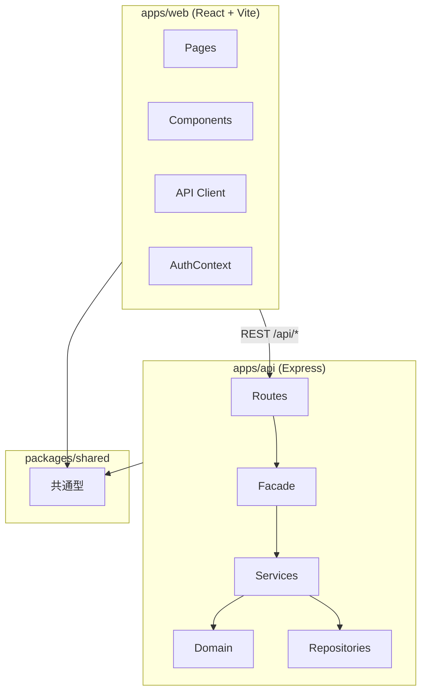
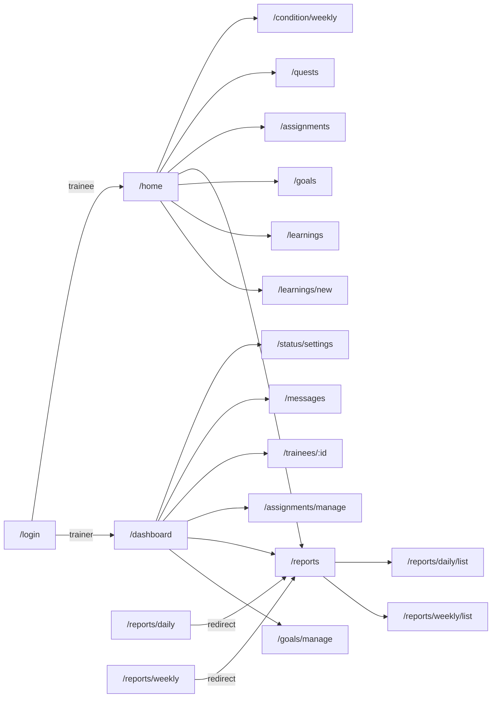
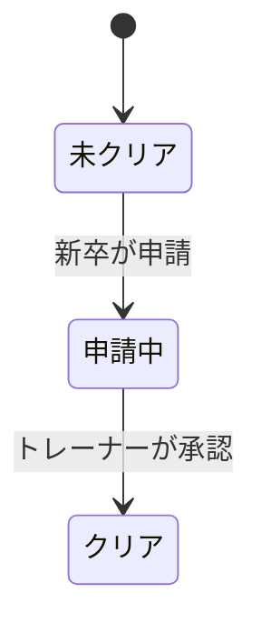
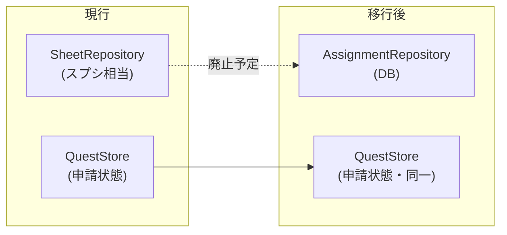

# OJT App 詳細設計書（ベース）

> **文書の目的**: 現時点の実装を正として整理し、今後の機能追加・改修の設計ベースとする。  
> **最終更新**: 2026-07-06  
> **ステータス**: ドラフト（v0.4 — 機能開発ステータス明示）

---

## 1. ドキュメント管理

| 項目           | 内容                                                                                                                                                                                                                                            |
| -------------- | ----------------------------------------------------------------------------------------------------------------------------------------------------------------------------------------------------------------------------------------------- |
| 関連文書       | [README.md](../README.md)、[docs/test-specs/](./test-specs/)（学び: [learning-feature.md](./test-specs/learning-feature.md)）、[api.md](./api.md)、[db.md](./db.md)、[reliability.md](./reliability.md)、[observability.md](./observability.md) |
| テスト仕様書   | 機能ごとのテストシナリオの正（TDD ワークフロー）                                                                                                                                                                                                |
| 本書の位置づけ | **アーキテクチャ・API・画面・データモデル・開発範囲の正**。実装前に §2.5 のステータスを確認する                                                                                                                                                 |
| ステータス凡例 | 本書 §2.5 を参照（`実装済` / `一部実装` / `設計済・未着手` / `計画のみ`）                                                                                                                                                                       |

### 1.1 改訂履歴

| 版  | 日付       | 変更内容                                             | 担当 |
| --- | ---------- | ---------------------------------------------------- | ---- |
| 0.1 | 2026-07-06 | 現行実装に基づく初版（ベース）                       | —    |
| 0.2 | 2026-07-06 | 永続化 DB 選定、新機能 4 件の設計追記                | —    |
| 0.3 | 2026-07-06 | **永続化 DB を Firestore に確定**、実装方針追記      | —    |
| 0.4 | 2026-07-06 | 機能開発ステータス一覧の追加、各章へのステータス明示 | —    |
| 0.5 | 2026-07-06 | GitHub Issues 対応表の追加（§2.5.1）                 | —    |

---

## 2. システム概要

### 2.1 背景・目的

新卒 OJT（On-the-Job Training）向け Web アプリケーション。Google スプレッドシートの育成計画（OJT 計画書）と連動し、以下を支援する。

- **課題（クエスト）管理**: トレーナーが課題を登録し、新卒が閲覧・クリア申請、トレーナーが承認（スプレッドシート連携の代替）
- **コンディション記録（モヤモヤ・温度計）**: 週次の業務量・理解度・メンタル入力とトレーナー向けアラート
- **トレーナーステータス・クイック質問**: 先輩の稼働状況可視化と、テンプレートベースの低ハードル質問
- **日次・週次報告書**: 新卒が振り返りを記録し、トレーナーが閲覧・フィードバック
- **目標・タスク管理（ガントチャート）**: 期間付きタスクの登録と進捗の可視化
- **学び共有**: その日に学んだ内容とリンクを記録・共有

### 2.2 インフラ・横断機能のスコープ

| 区分         | 内容                                                               | ステータス                          |
| ------------ | ------------------------------------------------------------------ | ----------------------------------- |
| 対象ユーザー | 新卒（trainee）、OJT トレーナー（trainer）                         | 実装済（固定 ID のみ）              |
| 対象環境     | ローカル開発、Docker、Google Cloud Run                             | 実装済                              |
| 永続化       | Firestore（`DB_PROVIDER=firestore`）。テスト・未設定時はインメモリ | **実装済**                          |
| 認証         | モック（ロール選択式ログイン、HTTP ヘッダーによる擬似認可）        | 実装済                              |
| 外部連携     | Google Sheets API                                                  | **廃止予定**（§7.4 課題管理で代替） |

### 2.5 機能開発ステータス一覧

> **開発時は本表を最初に確認すること。** `設計済・未着手` の機能は、依頼がない限り実装しない。`一部実装` は既知のギャップを残した状態。

#### ステータス凡例

| ステータス         | 意味                                                                      |
| ------------------ | ------------------------------------------------------------------------- |
| **実装済**         | 現行スコープで API・画面が動作し、本番（Cloud Run + Firestore）で利用可能 |
| **一部実装**       | コア機能は動くが、設計上の残タスク・既知の制限がある                      |
| **設計済・未着手** | 本書に設計あり。コード・テスト仕様書は未作成または未着手                  |
| **計画のみ**       | ロードマップに記載。詳細設計（§7）未整備                                  |
| **廃止予定**       | 新規開発の対象外。段階的に置き換え・削除                                  |

#### 機能一覧

| ID   | 機能                                   | ステータス         | 優先 | 詳細       | テスト仕様書                                                                                               |
| ---- | -------------------------------------- | ------------------ | ---- | ---------- | ---------------------------------------------------------------------------------------------------------- |
| F-01 | クエスト管理（一覧・申請・承認）       | **実装済**         | —    | §7.1       | [quest-feature.md](./test-specs/quest-feature.md)                                                          |
| F-02 | コンディション記録（モヤモヤ・温度計） | **一部実装**       | —    | §7.2       | [condition-feature.md](./test-specs/condition-feature.md)                                                  |
| F-03 | トレーナーステータス・クイック質問     | **一部実装**       | —    | §7.3       | [status-feature.md](./test-specs/status-feature.md)、[message-feature.md](./test-specs/message-feature.md) |
| F-04 | Firestore 永続化                       | **実装済**         | —    | §9         | —                                                                                                          |
| F-05 | モック認証・ロール制御                 | **実装済**         | —    | §5         | —                                                                                                          |
| F-06 | 課題管理（トレーナー入力・スプシ代替） | **実装済**         | P1   | §7.4       | [quest-feature.md](./test-specs/quest-feature.md)（F-01 移行節）                                           |
| F-07 | 日次・週次報告書                       | **設計済・未着手** | P1   | §7.5       | 未作成                                                                                                     |
| F-08 | 目標・タスク管理（ガントチャート）     | **実装済**         | P2   | §7.6       | [goal-feature.md](./test-specs/goal-feature.md)                                                            |
| F-09 | 学び共有（デイリーログ + リンク）      | **実装済**         | P2   | §7.7       | [learning-feature.md](./test-specs/learning-feature.md)                                                    |
| F-10 | 本番認証（Identity Platform 等）       | **計画のみ**       | —    | §5.4       | —                                                                                                          |
| F-11 | 複数新卒・複数トレーナー               | **計画のみ**       | —    | §13        | —                                                                                                          |
| F-12 | Google Sheets 連携                     | **廃止予定**       | —    | §7.1（旧） | —                                                                                                          |

#### 一部実装の既知ギャップ（F-01〜F-03）

| ID   | ギャップ                                                                             | 対応予定                                                  |
| ---- | ------------------------------------------------------------------------------------ | --------------------------------------------------------- |
| F-01 | ~~課題データ源が `SheetRepository`（インメモリ）のまま。トレーナーによる CRUD なし~~ | **解消済**（`AssignmentRepository` + `/api/assignments`） |
| F-02 | グラフ API はサービス層のみ。フロントに推移グラフなし                                | 別途 UI 実装                                              |
| F-02 | 入力値 1〜5 のサーバー側バリデーション不足                                           | ドメイン層で追加                                          |
| F-03 | メッセージ非リアルタイム（手動リロード）                                             | WebSocket / ポーリング（計画のみ）                        |
| F-03 | 新卒・トレーナーが各 1 ユーザー固定                                                  | F-11                                                      |

#### 実装フェーズとステータス

| フェーズ | 内容                      | ステータス |
| -------- | ------------------------- | ---------- |
| Phase 0  | Firestore Emulator 基盤   | **完了**   |
| Phase 1  | 既存機能の Firestore 移行 | **完了**   |
| Phase 2  | 課題管理（§7.4）          | **完了**   |
| Phase 3  | 日次・週次報告（§7.5）    | 未着手     |
| Phase 4  | 学び共有（§7.7）          | 実装済     |
| Phase 5  | ガント（§7.6）            | 実装済     |
| Phase 6  | BigQuery 分析（任意）     | 計画のみ   |

#### 開発対象外（現時点）

以下は **設計済・未着手** または **計画のみ** のため、明示的な依頼がない限り実装しない。

- F-10 本番認証
- F-11 マルチユーザー
- F-12 Google Sheets 連携（新規実装）

#### 2.5.1 GitHub Issues 対応表

進捗管理は GitHub Issues を正とする。仕様の正は引き続き本書。

| 設計 ID          | GitHub Issue                                                | タイトル                                               |
| ---------------- | ----------------------------------------------------------- | ------------------------------------------------------ |
| F-01（ギャップ） | [#4](https://github.com/yuna-tsuji-ambl/OJT-app/issues/4)   | クエスト: SheetRepository 廃止と課題データへの移行     |
| F-02（ギャップ） | [#5](https://github.com/yuna-tsuji-ambl/OJT-app/issues/5)   | コンディション: 推移グラフのフロントエンド表示         |
| F-02（ギャップ） | [#6](https://github.com/yuna-tsuji-ambl/OJT-app/issues/6)   | コンディション: 入力値 1〜5 のサーバー側バリデーション |
| F-03（ギャップ） | [#7](https://github.com/yuna-tsuji-ambl/OJT-app/issues/7)   | クイック質問: メッセージのリアルタイム更新             |
| F-06             | [#8](https://github.com/yuna-tsuji-ambl/OJT-app/issues/8)   | 課題管理（トレーナー入力・スプシ代替）                 |
| F-07             | [#9](https://github.com/yuna-tsuji-ambl/OJT-app/issues/9)   | 日次・週次報告書                                       |
| F-09             | [#10](https://github.com/yuna-tsuji-ambl/OJT-app/issues/10) | 学び共有（デイリーログ + リンク）                      |
| F-08             | [#11](https://github.com/yuna-tsuji-ambl/OJT-app/issues/11) | 目標・ガントチャート管理                               |
| F-11             | [#12](https://github.com/yuna-tsuji-ambl/OJT-app/issues/12) | 複数新卒・複数トレーナー対応                           |
| F-10             | [#13](https://github.com/yuna-tsuji-ambl/OJT-app/issues/13) | 本番認証（Identity Platform 等）                       |
| —                | [#14](https://github.com/yuna-tsuji-ambl/OJT-app/issues/14) | E2E テストの本格運用                                   |
| Phase 6          | [#15](https://github.com/yuna-tsuji-ambl/OJT-app/issues/15) | BigQuery 分析連携（任意）                              |
| F-12             | [#16](https://github.com/yuna-tsuji-ambl/OJT-app/issues/16) | SheetRepository の段階的廃止・削除                     |

PR では `Closes #8` のように Issue 番号を記載して自動クローズする。

### 2.6 将来拡張（その他・計画のみ）

- [ ] 本番認証（Identity Platform / Firebase Auth 等）
- [ ] E2E テスト本格運用（Playwright 設定済み、仕様書整備中）
- [ ] 複数新卒・複数トレーナー対応
- [ ] コンディション推移の折れ線グラフ表示（フロントエンド）
- [ ] リアルタイムメッセージ更新（WebSocket / SSE 等）
- [ ] BigQuery 連携（分析・ダッシュボード集計用。§9.4 参照）
- [ ] ~~Google Sheets API 連携~~ → **課題管理機能で代替**（`SheetRepository` は段階的に廃止予定）

---

## 3. アーキテクチャ

### 3.1 全体構成



### 3.2 モノレポ構成

```
OJT-app-1/
├── apps/
│   ├── web/          # React フロントエンド（@ojt-app/web）
│   └── api/            # Express API（@ojt-app/api）
├── packages/
│   └── shared/       # FE/BE 共通型（@ojt-app/shared）
├── docs/
│   ├── detailed-design.md   # 本書
│   └── test-specs/            # テスト仕様書（TDD の正）
├── tests/            # Playwright E2E（*.spec.test.ts）
├── Dockerfile        # Cloud Run 用（FE + API 単一コンテナ）
└── package.json      # npm workspaces ルート
```

### 3.3 バックエンド レイヤー

| レイヤー         | パス                                | 責務                                                     |
| ---------------- | ----------------------------------- | -------------------------------------------------------- |
| エントリポイント | `apps/api/src/server.ts`            | Express 起動、ルーター登録、静的ファイル配信             |
| ルート           | `apps/api/src/routes/*Routes.ts`    | HTTP リクエスト受付、バリデーション、レスポンス          |
| Facade           | `apps/api/src/api/*Facade.ts`       | サービス呼び出しの薄いラッパー（テスト・ルートから利用） |
| サービス         | `apps/api/src/services/*Service.ts` | ビジネスロジック、認可チェック                           |
| ドメイン         | `apps/api/src/domain/*`             | 型、定数、純粋関数、ドメイン例外                         |
| リポジトリ       | `apps/api/src/repositories/*`       | データアクセス抽象化・インメモリ実装                     |

### 3.4 フロントエンド構成

| レイヤー         | パス                       | 責務                                     |
| ---------------- | -------------------------- | ---------------------------------------- |
| ルーティング     | `apps/web/src/App.tsx`     | 画面遷移定義                             |
| 認証             | `apps/web/src/auth/`       | ロール選択ログイン、ユーザーコンテキスト |
| ページ           | `apps/web/src/pages/`      | 画面単位のコンテナ                       |
| コンポーネント   | `apps/web/src/components/` | 再利用 UI                                |
| API クライアント | `apps/web/src/api/`        | REST 呼び出し                            |
| ドメイン定数     | `apps/web/src/domain/`     | フロント固有の表示用定数                 |

---

## 4. 技術スタック

| 領域             | 技術                             | 備考                           |
| ---------------- | -------------------------------- | ------------------------------ |
| フロントエンド   | React 18+, Vite, TypeScript      | CSS: `index.css`（グローバル） |
| ルーティング     | react-router-dom v6              |                                |
| バックエンド     | Node.js 22+, Express, TypeScript | ESM（`"type": "module"`）      |
| 共有型           | `@ojt-app/shared`                | Quest, UserRole 等             |
| 単体・結合テスト | Vitest                           | `apps/api/src/__tests__/`      |
| E2E テスト       | Playwright                       | `tests/*.spec.test.ts`         |
| インフラ         | Docker, Google Cloud Run         | ポート 8080                    |

### 4.1 開発・ビルドコマンド

| コマンド           | 説明                                                                    |
| ------------------ | ----------------------------------------------------------------------- |
| `npm run dev`      | フロント開発サーバー（:5173）                                           |
| `npm run dev:api`  | API サーバー（:8080）                                                   |
| `npm run dev:all`  | 両方同時起動                                                            |
| `npm run build`    | shared → api → web の順でビルド                                         |
| `npm test`         | API 単体・結合テスト（CI では続けて `npm test -w @ojt-app/web` も実行） |
| `npm run test:e2e` | Playwright E2E                                                          |
| `npm start`        | ビルド済み API 起動（本番相当）                                         |

### 4.2 ローカル開発時のプロキシ

Vite（`apps/web/vite.config.ts`）が `/api` および `/health` を `localhost:8080` にプロキシする。

---

## 5. ユーザー・認証・認可

### 5.1 ユーザーロール

| ロール     | 識別子    | 固定 userId（現行） | 主な利用画面                               |
| ---------- | --------- | ------------------- | ------------------------------------------ |
| 新卒       | `trainee` | `trainee-1`         | ホーム、週次入力、クエスト一覧             |
| トレーナー | `trainer` | `trainer-1`         | ダッシュボード、ステータス設定、メッセージ |

### 5.2 認証（現行：モック）

**フロントエンド**（`AuthContext.tsx`）:

- ログイン画面でロールを選択
- `AuthUser { userId, role }` を React Context に保持
- 全 API 呼び出しで HTTP ヘッダーを付与

**バックエンド**（`expressUserContext.ts`）:

| ヘッダー      | 必須 | 値                             |
| ------------- | ---- | ------------------------------ |
| `X-User-Id`   | ○    | ユーザー ID（例: `trainee-1`） |
| `X-User-Role` | ○    | `trainee` または `trainer`     |

ヘッダー欠落・不正時は `401 Unauthorized`。

### 5.3 認可

`domain/authorization.ts` によりロールチェック:

| 関数            | 許可ロール   |
| --------------- | ------------ |
| `ensureTrainee` | trainee のみ |
| `ensureTrainer` | trainer のみ |

違反時は `ForbiddenError` → HTTP 403。

### 5.4 将来の認証設計（プレースホルダ）

<!-- TODO: 本番認証方式確定後に追記 -->

- 認証プロバイダ:
- トークン形式:
- ユーザー ID とロールの取得方法:
- 既存 `X-User-*` ヘッダーからの移行方針:

---

## 6. 画面設計

### 6.1 画面一覧・ルーティング

| パス                   | ページ                                            | ロール           | 概要                                                                                             |
| ---------------------- | ------------------------------------------------- | ---------------- | ------------------------------------------------------------------------------------------------ |
| `/login`               | LoginPage                                         | 未ログイン       | ロール選択ログイン                                                                               |
| `/home`                | TraineeHomePage                                   | trainee          | トレーナーステータス表示、クイック質問、チャット履歴                                             |
| `/condition/weekly`    | WeeklyConditionPage                               | trainee          | 週次コンディション入力                                                                           |
| `/quests`              | —（`/assignments` へリダイレクト）                | trainee          | 旧 URL 互換                                                                                      |
| `/assignments`         | AssignmentListPage                                | trainee          | トレーナー登録課題の一覧・クリア申請                                                             |
| `/assignments/manage`  | AssignmentManagePage                              | trainer          | 課題の作成・編集・削除                                                                           |
| `/dashboard`           | DashboardPage                                     | trainer          | 申請中課題承認、コンディションアラート                                                           |
| `/status/settings`     | TrainerStatusSettingsPage                         | trainer          | トレーナーステータス変更                                                                         |
| `/messages`            | TrainerMessagesPage                               | trainer          | 受信質問・簡易返信                                                                               |
| `/trainees/:traineeId` | TraineeDetailPage                                 | trainer（想定）  | 新卒の最新コンディション表示                                                                     |
| **（追加予定）**       |                                                   |                  |                                                                                                  |
| `/reports`             | ReportPage（trainee） / ReportListPage（trainer） | trainee, trainer | 新卒: 日次・週次入力（同一ページ）。トレーナー: 担当新卒の報告書一覧。ヘッダー「報告書」から遷移 |
| `/reports/daily/list`  | TraineeDailyReportListPage                        | trainee          | 過去日次一覧（本文検索、`from`/`to` または `date`。同時指定はエラー）                            |
| `/reports/weekly/list` | TraineeWeeklyReportListPage                       | trainee          | 過去週次一覧（本文検索、`from`/`to` または `date`＝日付/週キー両可。同時指定はエラー）           |
| `/reports/daily`       | —（`/reports` へリダイレクト）                    | trainee          | 旧日次入力 URL 互換                                                                              |
| `/reports/weekly`      | —（`/reports` へリダイレクト）                    | trainee          | 旧週次入力 URL 互換                                                                              |
| `/goals`               | GoalGanttPage                                     | trainee, trainer | 目標・タスクのガントチャート表示（バー移動・端ドラッグで期間変更可）。ヘッダー「目標」から遷移   |
| `/goals/manage`        | GoalManagePage                                    | trainee, trainer | 目標の登録・変更（双方）。削除はトレーナーのみ                                                   |
| `/learnings`           | LearningFeedPage                                  | trainee, trainer | 学び共有タイムライン                                                                             |
| `/learnings/new`       | LearningCreatePage                                | trainee          | その日の学び + リンク投稿                                                                        |
| `*`                    | —                                                 | —                | `/login` へリダイレクト                                                                          |

**レイアウト**: ログイン後は `Layout` コンポーネント（ヘッダーナビ + ログアウト）でラップ。

### 6.2 画面遷移（概要）



### 6.3 主要 UI コンポーネント

| コンポーネント            | 利用画面           | 役割                             |
| ------------------------- | ------------------ | -------------------------------- |
| `ConditionSlider`         | 週次入力           | 1〜5 のスライダー入力            |
| `QuestCard`               | クエスト一覧       | クエスト表示・申請ボタン         |
| `PendingQuestCard`        | ダッシュボード     | 申請中クエスト・承認ボタン       |
| `ConditionAlertCard`      | ダッシュボード     | SOS アラート表示                 |
| `TrainerStatusPanel`      | ホーム             | トレーナー現在ステータス         |
| `TrainerStatusRadioGroup` | ステータス設定     | ステータス切替                   |
| `QuestionForm`            | ホーム             | 質問テンプレ選択・送信           |
| `ReplyStampBar`           | メッセージ         | 返信スタンプ送信                 |
| `ChatHistory`             | ホーム、メッセージ | チャット履歴表示                 |
| **（追加予定）**          |                    |                                  |
| `AssignmentForm`          | 課題管理           | 課題 CRUD フォーム               |
| `AssignmentCard`          | 課題一覧           | 課題表示・申請                   |
| `ReportForm`              | 日次/週次報告      | テンプレート入力フォーム         |
| `ReportCard`              | 報告一覧           | 報告サマリー表示                 |
| `GanttChart`              | 目標管理           | 期間バー可視化（ライブラリ TBD） |
| `GoalForm`                | 目標管理           | タスク名・期間・依存の入力       |
| `LearningPostCard`        | 学び共有           | メモ + リンク一覧表示            |
| `LinkInputList`           | 学び投稿           | 複数 URL 入力                    |

### 6.4 画面別 API 利用

| 画面                                 | 呼び出し API                                                                                                                                                            |
| ------------------------------------ | ----------------------------------------------------------------------------------------------------------------------------------------------------------------------- |
| TraineeHomePage                      | `GET /api/status/trainer/:id`, `POST /api/status/messages`, `GET /api/status/messages`                                                                                  |
| WeeklyConditionPage                  | `POST /api/condition`                                                                                                                                                   |
| QuestListPage                        | `GET /api/assignments`, `POST /api/assignments/:id/request`（旧 `/api/quests` 互換あり）                                                                                |
| AssignmentListPage                   | `GET /api/assignments`, `POST /api/assignments/:id/request`                                                                                                             |
| AssignmentManagePage                 | `GET/POST/PUT/DELETE /api/assignments`                                                                                                                                  |
| DashboardPage                        | `GET /api/assignments/pending`, `POST /api/assignments/:id/approve`, `GET /api/condition/alerts`                                                                        |
| TrainerStatusSettingsPage            | `GET /api/status/trainer/:id`, `PUT /api/status`                                                                                                                        |
| TrainerMessagesPage                  | `GET /api/status/messages`, `POST /api/status/messages`                                                                                                                 |
| TraineeDetailPage                    | `GET /api/condition/trainees/:id/latest`                                                                                                                                |
| **（追加予定）**                     |                                                                                                                                                                         |
| ReportPage（trainee `/reports`）     | `GET/PUT /api/reports/daily/:date`、`GET/PUT /api/reports/weekly/:weekKey`。日次入力欄直下リンク → `/reports/daily/list`、週次入力欄直下リンク → `/reports/weekly/list` |
| TraineeDailyReportListPage           | `GET /api/reports/daily?q=&from=&to=` または `?date=`（排他。同時指定時は「期間の範囲指定と特定日は同時に使えません。どちらか一方だけを指定してください。」）           |
| TraineeWeeklyReportListPage          | `GET /api/reports/weekly?q=&from=&to=` または `?date=`（日付/週キー両対応。同時指定時のエラー文言は日次と同様）                                                         |
| ReportListPage（trainer `/reports`） | `GET /api/reports?traineeId=&type=`（`type` は任意）。導線はヘッダー「報告書」（ダッシュボードの「報告書一覧」リンクは置かない）                                        |
| ReportDetailPage                     | `GET /api/reports/:id`、`POST/PUT /api/reports/:id/comments`（トレーナー）                                                                                              |
| GoalGanttPage                        | `GET /api/goals`                                                                                                                                                        |
| GoalManagePage                       | `GET/POST/PUT/DELETE /api/goals`                                                                                                                                        |
| LearningFeedPage                     | `GET /api/learnings`                                                                                                                                                    |
| LearningCreatePage                   | `POST /api/learnings`                                                                                                                                                   |

---

## 7. 機能設計

### 7.1 クエスト管理 `一部実装（F-01）`

#### 7.1.1 概要

スプレッドシートの育成計画と連動し、新卒がタスクのクリア申請を行い、トレーナーが承認する。

#### 7.1.2 ステータス遷移



| ステータス | 定数                       | 説明               |
| ---------- | -------------------------- | ------------------ |
| 未クリア   | `QUEST_STATUS.NOT_CLEARED` | 初期状態           |
| 申請中     | `QUEST_STATUS.PENDING`     | 新卒が申請済み     |
| クリア     | `QUEST_STATUS.CLEARED`     | トレーナー承認済み |

#### 7.1.3 処理フロー

**一覧取得（新卒）**:

1. `SheetRepository.loadQuests(userId)` でクエスト取得
2. 現行はインメモリのシードデータを返却

**クリア申請（新卒）**:

1. ロール検証（trainee）
2. `QuestStore` からクエスト取得
3. ステータスを「申請中」に更新

**申請一覧（トレーナー）**:

1. ロール検証（trainer）
2. `QuestStore.getPendingQuests()` で「申請中」をフィルタ

**承認（トレーナー）**:

1. ロール検証（trainer）
2. ステータスを「クリア」に更新
3. `SheetRepository.updateOnApproval(quest)` でシート更新（現行はインメモリ）

#### 7.1.4 ドメインモデル

```typescript
interface Quest {
  id: string;
  majorItem: string; // 大項目
  minorItem: string; // 小項目
  achievementLevel: string; // 到達レベル
  status?: QuestStatus;
}

type QuestStatus = '未クリア' | '申請中' | 'クリア';
```

#### 7.1.5 シードデータ

| id      | 大項目   | 小項目    | 到達レベル | 初期ステータス |
| ------- | -------- | --------- | ---------- | -------------- |
| quest-a | 開発基礎 | クエストA | Lv1        | 未クリア       |

#### 7.1.6 テスト仕様

→ [docs/test-specs/quest-feature.md](./test-specs/quest-feature.md)

---

### 7.2 コンディション記録（モヤモヤ・温度計） `一部実装（F-02）`

#### 7.2.1 概要

新卒が週次で業務量・理解度・メンタルを入力し、トレーナーがアラートを把握する。

#### 7.2.2 入力項目

| 項目     | フィールド      | スケール           | 初期値 |
| -------- | --------------- | ------------------ | ------ |
| 業務量   | `workload`      | 1〜5               | 3      |
| 理解度   | `comprehension` | 1〜5               | 3      |
| メンタル | `mental`        | 1〜5（1=しんどい） | 3      |

#### 7.2.3 アラート判定

**ダッシュボード（SOSアラート）**

- **条件**: 直近記録の業務量・理解度・メンタルのいずれかが `1`（`CONDITION_ALERT_THRESHOLD`）
- **メッセージ**: 「要フォロー」（`CONDITION_ALERT_MESSAGE`）

**コンディション画面**

- **条件**: ダッシュボードと同様（直近記録のいずれかが `1`）
- **メッセージ**: 「新卒が不安定です。」（`CONDITION_PAGE_ALERT_MESSAGE`）

- **監視対象新卒**: `MONITORED_TRAINEE_IDS = ['trainee-1']`（固定）

#### 7.2.4 処理フロー

**記録送信（新卒）**:

1. ロール検証（trainee）
2. `ConditionRecordStore.save(userId, draft)`
3. 完了メッセージ「記録しました」を返却

**アラート一覧（トレーナー）**:

1. ロール検証（trainer）
2. 監視対象新卒ごとに履歴取得 → `buildConditionAlert`

**最新記録取得（トレーナー）**:

1. ロール検証（trainer）
2. 指定新卒の最新履歴を返却（なければ 404）

**グラフデータ（トレーナー）**:

1. ロール検証（trainer）
2. 指定新卒の履歴から `buildConditionGraphData` で 3 項目の時系列データを返却

- `GET /api/condition/trainees/:traineeId/graph` で公開済み
- トレーナーコンディション画面で推移を**折れ線グラフ**表示（横軸: `labels`、系列: `workload` / `comprehension` / `mental`）

**コンディション画面アラート（トレーナー）**:

1. ロール検証（trainer）
2. 指定新卒の履歴から `buildConditionPageAlert` で画面用アラートを返却

- `GET /api/condition/trainees/:traineeId/page-alert` で公開済み

#### 7.2.5 ドメインモデル

```typescript
interface ConditionDraft {
  workload: number;
  comprehension: number;
  mental: number;
}

interface ConditionHistoryRecord extends ConditionDraft {
  recordedAt: string; // ISO 8601
}

interface ConditionPageAlert {
  hasAlert: boolean;
  message: string;
}

interface ConditionAlert extends ConditionPageAlert {
  traineeId: string;
  latestMental: number;
}

interface ConditionGraphData {
  labels: string[];
  workload: number[];
  comprehension: number[];
  mental: number[];
  rows: ConditionHistoryRecord[];
}

/** 推移表の1行。履歴レコードと同一構造 */
type ConditionGraphTableRow = ConditionHistoryRecord;
```

#### 7.2.6 テスト仕様

→ [docs/test-specs/condition-feature.md](./test-specs/condition-feature.md)

---

### 7.3 トレーナーステータス・クイック質問 `一部実装（F-03）`

#### 7.3.1 概要

トレーナーの稼働ステータスを可視化し、新卒がテンプレートで質問、トレーナーがスタンプで返信する。

#### 7.3.2 トレーナーステータス

| ステータス | 定数                        | 説明         |
| ---------- | --------------------------- | ------------ |
| 質問OK     | `TRAINER_STATUS.QUEST_OK`   | 質問受付可能 |
| 集中モード | `TRAINER_STATUS.FOCUS_MODE` | 集中中       |

#### 7.3.3 チャット

| 種別 | type 値    | 送信者     | 内容例                        |
| ---- | ---------- | ---------- | ----------------------------- |
| 質問 | `question` | 新卒       | 「〇〇の件で3分いいですか？」 |
| 返信 | `reply`    | トレーナー | 「後で話そう」                |

**会話の前提**: 現行は `trainer-1` ↔ `trainee-1` の 1 対 1 固定。

#### 7.3.4 処理フロー

**ステータス更新（トレーナー）**:

1. ロール検証（trainer）
2. `TrainerStatusStore.update(userId, status)`

**ステータス取得（新卒）**:

1. ロール検証（trainee）
2. 指定 trainerId のステータス返却

**質問送信（新卒）**:

1. ロール検証（trainee）
2. `buildQuickQuestion` → `ChatMessageStore.append`

**返信送信（トレーナー）**:

1. ロール検証（trainer）
2. `buildQuickReply` → `ChatMessageStore.append`

**メッセージ一覧**:

1. 参加者（trainerId または traineeId）のみ閲覧可
2. それ以外は 403

#### 7.3.5 ドメインモデル

```typescript
interface TrainerStatusRecord {
  userId: string;
  status: TrainerStatusType;
}

interface ChatMessage {
  senderId: string;
  receiverId: string;
  content: string;
  type: 'question' | 'reply';
}
```

#### 7.3.6 テスト仕様

| 対象                        | 仕様書                                                                |
| --------------------------- | --------------------------------------------------------------------- |
| トレーナーステータス        | [status-feature.md](./test-specs/status-feature.md)（U-S01〜U-S02）   |
| 質問・メッセージ・スレッド  | [message-feature.md](./test-specs/message-feature.md)（U-M / E-M 系） |
| ステータス＋質問の E2E 統合 | [status-feature.md](./test-specs/status-feature.md)（E-S01）          |

---

### 7.4 課題管理（トレーナー入力・スプシ代替） `実装済（F-06）`

#### 7.4.1 概要

Google スプレッドシート連携が困難なため、**トレーナーが Web 上で課題（旧クエスト）を登録**し、**新卒が一覧閲覧・クリア申請**する。既存のクエスト申請・承認フロー（§7.1）を再利用し、データソースを `SheetRepository` から **DB 上の Assignment テーブル** に置き換える。

#### 7.4.2 ユースケース

| UC-ID  | アクター | 操作                                                       | 結果                                    |
| ------ | -------- | ---------------------------------------------------------- | --------------------------------------- |
| UC-A01 | trainer  | 課題を新規作成（タイトル、説明、大項目、到達レベル、期限） | 担当新卒に表示される                    |
| UC-A02 | trainer  | 課題を編集・削除                                           | 新卒側一覧に反映                        |
| UC-A03 | trainee  | 自分に割り当てられた課題一覧を閲覧                         | 未クリア / 申請中 / クリア が表示       |
| UC-A04 | trainee  | 課題のクリア申請                                           | ステータスが「申請中」に（§7.1 と同一） |
| UC-A05 | trainer  | 申請中課題を承認                                           | ステータスが「クリア」に                |

#### 7.4.3 既存クエスト機能との関係



- **一覧取得**: `SheetRepository.loadQuests` → `AssignmentRepository.findByTraineeId`
- **承認時の更新**: `SheetRepository.updateOnApproval` → `AssignmentRepository.updateStatus`
- フロントの `/quests` は `/assignments` にリネームまたはリダイレクトを検討

#### 7.4.4 ドメインモデル

```typescript
interface Assignment {
  id: string;
  traineeId: string; // 割り当て先新卒
  createdBy: string; // 登録トレーナー ID
  majorItem: string; // 大項目（カテゴリ）
  title: string; // 小項目相当（課題名）
  description: string; // 詳細・達成条件
  achievementLevel: string; // 到達レベル
  dueDate?: string; // 期限（ISO 8601 date、任意）
  status: QuestStatus; // 未クリア | 申請中 | クリア（既存型を流用）
  createdAt: string;
  updatedAt: string;
}
```

#### 7.4.5 テスト仕様

→ `docs/test-specs/quest-feature.md`「F-01 ギャップ解消: SheetRepository 廃止と AssignmentRepository 移行」（U-A / I-A / E-A 系）

---

### 7.5 日次・週次報告書 `設計済・未着手（F-07）`

#### 7.5.1 概要

新卒が**日次**および**週次**の振り返りをテンプレートに沿って記録し、トレーナーが一覧・詳細を閲覧する。コンディション（§7.2）とは別に、**文章ベースの業務報告**を担う。

#### 7.5.2 報告種別

| 種別 | キー                 | 入力タイミング       | 主な項目                                           |
| ---- | -------------------- | -------------------- | -------------------------------------------------- |
| 日次 | `YYYY-MM-DD`         | 毎日（推奨: 退勤前） | 本日やったこと、学び、困っていること、明日やること |
| 週次 | `YYYY-Www`（ISO 週） | 週 1 回（例: 金曜）  | 今週の成果、来週の目標、所感、トレーナーへの相談   |

#### 7.5.3 ユースケース

| UC-ID  | アクター | 操作                             | 結果                                                                                                                                                                                                                                                   |
| ------ | -------- | -------------------------------- | ------------------------------------------------------------------------------------------------------------------------------------------------------------------------------------------------------------------------------------------------------ |
| UC-R01 | trainee  | 日次報告を作成・下書き保存・提出 | 指定日の報告が DB に保存                                                                                                                                                                                                                               |
| UC-R02 | trainee  | 週次報告を作成・提出             | 指定週の報告が DB に保存                                                                                                                                                                                                                               |
| UC-R03 | trainee  | 過去の自分の報告を閲覧           | `/reports/daily/list`・`/reports/weekly/list` で一覧・詳細表示。本文全体検索。期間は `from`/`to` または `date`（排他。同時指定時は「期間の範囲指定と特定日は同時に使えません。どちらか一方だけを指定してください。」）。週次の値は日付と週キーの両方可 |
| UC-R04 | trainer  | 担当新卒の報告一覧を閲覧         | 未読・最新順で表示                                                                                                                                                                                                                                     |
| UC-R05 | trainer  | 報告にコメント（任意・Phase 2）  | 新卒がフィードバックを確認                                                                                                                                                                                                                             |

#### 7.5.4 ドメインモデル

```typescript
type ReportType = 'daily' | 'weekly';
type ReportStatus = 'draft' | 'submitted';

interface DailyReportContent {
  doneToday: string; // 本日やったこと
  learnedToday: string; // 学んだこと
  blockers: string; // 困っていること
  planTomorrow: string; // 明日やること
}

interface WeeklyReportContent {
  achievements: string; // 今週の成果
  nextWeekGoals: string; // 来週の目標
  reflection: string; // 所感
  questionsForTrainer: string; // トレーナーへの相談
}

interface ReportComment {
  id: string;
  authorId: string;
  content: string;
  createdAt: string;
}

interface Report {
  id: string;
  traineeId: string;
  type: ReportType;
  periodKey: string; // '2026-07-06' or '2026-W27'
  content: DailyReportContent | WeeklyReportContent;
  status: ReportStatus;
  comments: ReportComment[]; // UC-R05（Phase 2）
  submittedAt?: string;
  createdAt: string;
  updatedAt: string;
}
```

#### 7.5.5 テスト仕様

→ `docs/test-specs/report-feature.md`

---

### 7.6 目標・タスク管理（ガントチャート） `実装済（F-08）`

#### 7.6.1 概要

OJT 期間中の**目標（タスク）**を期間付きで登録し、**ガントチャート**で進捗・スケジュールを可視化する。  
**新卒・トレーナー双方が作成・変更でき、同一データとして連動する。削除はトレーナーのみ。**

#### 7.6.2 ユースケース

| UC-ID  | アクター          | 操作                                                                 | 結果                       |
| ------ | ----------------- | -------------------------------------------------------------------- | -------------------------- |
| UC-G01 | trainer / trainee | 目標タスクを登録（名前、開始日、終了日。トレーナーは担当新卒指定可） | ガントにバー表示（連動）   |
| UC-G02 | trainer / trainee | 進捗率（0〜100%）・ステータス・タイトル・期間を更新                  | バー表示が更新（連動）     |
| UC-G03 | trainee / trainer | ガントチャートで全体スケジュールを閲覧・バー移動・期間変更           | 期間横軸 + タスクバー      |
| UC-G04 | trainer           | 目標を削除                                                           | 双方の一覧・ガントから消失 |
| UC-G05 | trainer           | タスク間の依存関係を設定（Phase 2）                                  | 先行タスク完了後に着手可能 |

#### 7.6.3 ガントチャート UI

| 項目         | 方針                                                                                           |
| ------------ | ---------------------------------------------------------------------------------------------- |
| 実装         | 自前ガント（CSS + ポインタ操作）。外部ガントライブラリは未使用                                 |
| 初版スコープ | `/goals` で閲覧・バー移動・端ドラッグ期間変更。`/goals/manage` で CRUD（削除はトレーナーのみ） |
| 横軸         | **日単位**。軸ラベル「日付（日）」と `M/D` 目盛りを表示（期間が長い場合は間引き）              |
| 表示単位切替 | 週 / 月切替（Phase 2）                                                                         |

#### 7.6.4 ドメインモデル

```typescript
type GoalStatus = 'not_started' | 'in_progress' | 'completed' | 'blocked';

interface Goal {
  id: string;
  traineeId: string;
  createdBy: string;
  title: string;
  description?: string;
  startDate: string; // ISO 8601 date
  endDate: string;
  progress: number; // 0-100
  status: GoalStatus;
  dependsOnGoalId?: string; // Phase 2: 依存タスク
  createdAt: string;
  updatedAt: string;
}

interface GanttViewModel {
  goals: Goal[];
  rangeStart: string;
  rangeEnd: string;
}
```

#### 7.6.5 テスト仕様

→ [`docs/test-specs/goal-feature.md`](./test-specs/goal-feature.md)

---

### 7.7 学び共有（デイリーログ + リンク） `実装済（F-09）`

#### 7.7.1 概要

新卒が**その日に学んだ内容**を自由記述し、**参考 URL（記事・ドキュメント・PR 等）**を添えて投稿。トレーナーおよび（将来）チームメンバーがタイムライン形式で閲覧する。

#### 7.7.2 ユースケース

| UC-ID  | アクター          | 操作                                        | 結果               |
| ------ | ----------------- | ------------------------------------------- | ------------------ |
| UC-L01 | trainee           | 学び + リンクを投稿                         | タイムラインに追加 |
| UC-L02 | trainee / trainer | タイムラインを日付順で閲覧                  | 投稿一覧表示       |
| UC-L03 | trainee           | 自分の投稿を編集・削除（当日のみ、Phase 2） | 内容更新           |
| UC-L04 | trainer           | 投稿に「いいね」やコメント（Phase 2）       | フィードバック     |

#### 7.7.3 ドメインモデル

```typescript
interface LearningLink {
  url: string;
  label?: string; // 表示名（任意）
}

interface LearningPost {
  id: string;
  authorId: string; // 新卒 ID
  date: string; // 投稿日 YYYY-MM-DD
  title: string; // 一行サマリー
  body: string; // 学んだ内容（Markdown 可・Phase 2）
  links: LearningLink[];
  createdAt: string;
  updatedAt: string;
}
```

#### 7.7.4 日次報告との使い分け

| 機能             | 用途                                 | 公開範囲                |
| ---------------- | ------------------------------------ | ----------------------- |
| 日次報告（§7.5） | 業務振り返り・トレーナー向け正式報告 | トレーナー              |
| 学び共有（§7.7） | 気軽なナレッジ共有・リンク集         | トレーナー + 将来チーム |

#### 7.7.5 テスト仕様

→ [`docs/test-specs/learning-feature.md`](./test-specs/learning-feature.md)

---

## 8. API 設計

### 8.1 共通仕様

| 項目             | 内容                       |
| ---------------- | -------------------------- |
| ベースパス       | `/api`                     |
| Content-Type     | `application/json`         |
| 認証ヘッダー     | `X-User-Id`, `X-User-Role` |
| エラーレスポンス | `{ "error": string }`      |

### 8.2 ヘルスチェック

| メソッド | パス          | 認証 | レスポンス                                 |
| -------- | ------------- | ---- | ------------------------------------------ |
| GET      | `/health`     | 不要 | `{ status: "ok" }`                         |
| GET      | `/api/health` | 不要 | `{ status: "ok", service: "ojt-app-api" }` |

### 8.3 クエスト API

| メソッド | パス                           | ロール           | 説明               | 成功          |
| -------- | ------------------------------ | ---------------- | ------------------ | ------------- |
| GET      | `/api/quests`                  | 任意（認証必須） | クエスト一覧       | 200 `Quest[]` |
| GET      | `/api/quests/pending`          | trainer          | 申請中クエスト一覧 | 200 `Quest[]` |
| POST     | `/api/quests/:questId/request` | trainee          | クリア申請         | 200 `Quest`   |
| POST     | `/api/quests/:questId/approve` | trainer          | 承認               | 200 `Quest`   |

**エラー**:

| コード | 条件             |
| ------ | ---------------- |
| 401    | 認証ヘッダー不正 |
| 403    | ロール不一致     |
| 404    | クエスト不存在   |

### 8.4 コンディション API

| メソッド | パス                                            | ロール  | 説明         | 成功                         |
| -------- | ----------------------------------------------- | ------- | ------------ | ---------------------------- |
| POST     | `/api/condition`                                | trainee | 記録送信     | 200 `ConditionSubmitResult`  |
| GET      | `/api/condition/alerts`                         | trainer | アラート一覧 | 200 `ConditionAlert[]`       |
| GET      | `/api/condition/trainees/:traineeId/latest`     | trainer | 最新記録     | 200 `ConditionHistoryRecord` |
| GET      | `/api/condition/trainees/:traineeId/graph`      | trainer | 推移グラフ   | 200 `ConditionGraphData`     |
| GET      | `/api/condition/trainees/:traineeId/page-alert` | trainer | 画面アラート | 200 `ConditionPageAlert`     |

**POST `/api/condition` リクエストボディ**:

```json
{
  "workload": 3,
  "comprehension": 3,
  "mental": 1
}
```

**POST `/api/condition` レスポンス例**:

```json
{
  "message": "記録しました",
  "record": { "workload": 3, "comprehension": 3, "mental": 1 }
}
```

**エラー**:

| コード | 条件                            |
| ------ | ------------------------------- |
| 401    | 認証ヘッダー不正 / ロール不一致 |
| 404    | 最新記録なし                    |

### 8.5 ステータス・メッセージ API

| メソッド | パス                             | ロール            | 説明             | 成功                      |
| -------- | -------------------------------- | ----------------- | ---------------- | ------------------------- |
| PUT      | `/api/status`                    | trainer           | ステータス更新   | 200 `TrainerStatusRecord` |
| GET      | `/api/status/trainer/:trainerId` | trainee           | ステータス取得   | 200 `TrainerStatusRecord` |
| GET      | `/api/status/messages`           | 参加者            | メッセージ一覧   | 200 `ChatMessage[]`       |
| POST     | `/api/status/messages`           | trainee / trainer | 質問 or 返信送信 | 200 `ChatMessageResult`   |

**PUT `/api/status` リクエストボディ**:

```json
{ "status": "質問OK" }
```

**GET `/api/status/messages` クエリ**:

| パラメータ  | 必須 | 説明          |
| ----------- | ---- | ------------- |
| `trainerId` | ○    | トレーナー ID |
| `traineeId` | ○    | 新卒 ID       |

**POST `/api/status/messages` リクエスト（新卒・質問）**:

```json
{ "trainerId": "trainer-1", "content": "〇〇の件で3分いいですか？" }
```

**POST `/api/status/messages` リクエスト（トレーナー・返信）**:

```json
{ "traineeId": "trainee-1", "content": "後で話そう" }
```

**エラー**:

| コード | 条件                          |
| ------ | ----------------------------- |
| 400    | ステータス値不正 / クエリ不足 |
| 401    | 認証ヘッダー不正              |
| 403    | ロール不一致 / 会話参加者外   |
| 404    | トレーナーステータス不存在    |

### 8.6 追加予定 API（v0.2）

#### 8.6.1 課題管理

| メソッド | パス                           | ロール  | 説明                            |
| -------- | ------------------------------ | ------- | ------------------------------- |
| GET      | `/api/assignments`             | trainee | 自分に割り当てられた課題一覧    |
| GET      | `/api/assignments/manage`      | trainer | 登録済み課題一覧（管理用）      |
| POST     | `/api/assignments`             | trainer | 課題作成                        |
| PUT      | `/api/assignments/:id`         | trainer | 課題更新                        |
| DELETE   | `/api/assignments/:id`         | trainer | 課題削除                        |
| POST     | `/api/assignments/:id/request` | trainee | クリア申請（既存 quest と同等） |
| POST     | `/api/assignments/:id/approve` | trainer | 承認                            |

#### 8.6.2 報告書

| メソッド | パス                       | ロール  | 説明                                                                                                                                            |
| -------- | -------------------------- | ------- | ----------------------------------------------------------------------------------------------------------------------------------------------- |
| GET      | `/api/reports/daily`       | trainee | 自分の過去日次報告一覧（UC-R03）。`q`=本文全体検索。期間は `from`/`to` または `date`（`YYYY-MM-DD`、同時指定は 400）                            |
| GET      | `/api/reports/daily/:date` | trainee | 指定日の日次報告取得                                                                                                                            |
| PUT      | `/api/reports/daily/:date` | trainee | 日次報告の保存・提出                                                                                                                            |
| GET      | `/api/reports/weekly`      | trainee | 自分の過去週次報告一覧（UC-R03）。`q`=本文全体検索。期間は `from`/`to` または `date`（`YYYY-MM-DD`＝含む週、または `YYYY-Www`。同時指定は 400） |

| GET | `/api/reports/weekly/:weekKey` | trainee | 指定週の週次報告取得 |
| PUT | `/api/reports/weekly/:weekKey` | trainee | 週次報告の保存・提出 |
| GET | `/api/reports` | trainer | 報告一覧（`?traineeId=&type=`） |
| GET | `/api/reports/:id` | trainer, trainee | 報告詳細 |
| POST | `/api/reports/:id/comments` | trainer | 報告コメント追加（UC-R05） |
| PUT | `/api/reports/:id/comments/:commentId` | trainer | 報告コメント更新（UC-R05） |

#### 8.6.3 目標・ガント

| メソッド | パス             | ロール           | 説明                                                  |
| -------- | ---------------- | ---------------- | ----------------------------------------------------- |
| GET      | `/api/goals`     | trainee, trainer | ガント用目標一覧（`?traineeId=`。新卒は省略時に自身） |
| POST     | `/api/goals`     | trainee, trainer | 目標作成（双方。連動）                                |
| PUT      | `/api/goals/:id` | trainee, trainer | 目標更新（タイトル・期間・進捗・ステータス等）        |
| DELETE   | `/api/goals/:id` | trainer          | 目標削除（新卒は 403）                                |

#### 8.6.4 学び共有

| メソッド | パス                 | ロール           | 説明                                                            |
| -------- | -------------------- | ---------------- | --------------------------------------------------------------- |
| GET      | `/api/learnings`     | trainee, trainer | タイムライン（`?authorId=&from=&to=`。`date`/`createdAt` 降順） |
| POST     | `/api/learnings`     | trainee          | 学び投稿（201。トレーナーは 403）                               |
| PUT      | `/api/learnings/:id` | trainee          | 投稿更新（Phase 2）                                             |
| DELETE   | `/api/learnings/:id` | trainee          | 投稿削除（Phase 2）                                             |

#### 8.6.5 その他（既存拡張）

| メソッド | パス                                       | 説明                           |
| -------- | ------------------------------------------ | ------------------------------ |
| GET      | `/api/condition/trainees/:traineeId/graph` | コンディション推移グラフデータ |

---

## 9. データ設計

### 9.1 永続化方針

| モード         | 条件                             | 用途                               |
| -------------- | -------------------------------- | ---------------------------------- |
| **インメモリ** | `DB_PROVIDER` 未設定 or `memory` | Vitest、簡易ローカル起動           |
| **Firestore**  | `DB_PROVIDER=firestore`          | ローカル Emulator / Cloud Run 本番 |

| データ               | ストア IF              | インメモリ実装                 | Firestore 実装                  |
| -------------------- | ---------------------- | ------------------------------ | ------------------------------- |
| クエスト / 課題      | `AssignmentRepository` | `InMemoryAssignmentRepository` | `FirestoreAssignmentRepository` |
| コンディション履歴   | `ConditionRecordStore` | `InMemoryConditionRecordStore` | `FirestoreConditionRecordStore` |
| トレーナーステータス | `TrainerStatusStore`   | `InMemoryTrainerStatusStore`   | `FirestoreTrainerStatusStore`   |
| チャットメッセージ   | `ChatMessageStore`     | `InMemoryChatMessageStore`     | `FirestoreChatMessageStore`     |

**切替**: `createPersistence()`（`apps/api/src/repositories/createPersistence.ts`）が `server.ts` 起動時に選択する。

### 9.2 リポジトリインターフェース

#### SheetRepository

```typescript
interface SheetRepository {
  loadQuests(assigneeId: string): Promise<Quest[]>;
  updateOnApproval(quest: Quest): Promise<void>;
}
```

#### QuestStore

```typescript
interface QuestStore {
  getById(id: string): Promise<Quest | null>;
  update(quest: Quest): Promise<void>;
  getPendingQuests(): Promise<Quest[]>;
}
```

#### ConditionRecordStore

```typescript
interface ConditionRecordStore {
  save(traineeId: string, draft: ConditionDraft): Promise<void>;
  findHistoryByTraineeId(traineeId: string): Promise<ConditionHistoryRecord[]>;
}
```

#### TrainerStatusStore

```typescript
interface TrainerStatusStore {
  getByUserId(userId: string): Promise<TrainerStatusType | null>;
  update(userId: string, status: TrainerStatusType): Promise<void>;
}
```

#### ChatMessageStore

```typescript
interface ChatMessageStore {
  append(message: ChatMessage): Promise<void>;
  listBetween(traineeId: string, trainerId: string): Promise<ChatMessage[]>;
}
```

### 9.3 永続化 DB の選定

#### 9.3.1 BigQuery について

**BigQuery は本アプリのメイン DB には向きません。**

| 観点       | BigQuery                     | 本アプリが必要とする DB         |
| ---------- | ---------------------------- | ------------------------------- |
| 用途       | 分析・集計（DWH）            | トランザクション（OLTP）        |
| 操作       | バッチクエリ、大量スキャン   | 単行 CRUD、リアルタイム読み書き |
| レイテンシ | 秒〜分オーダー               | ミリ秒オーダー                  |
| 典型用途   | KPI ダッシュボード、ログ分析 | 課題登録、報告書保存、チャット  |

BigQuery は **将来**「全新卒のコンディション推移を組織横断で分析する」などの **分析レイヤー** として検討するのが適切です。日次の CRUD には使わない。

#### 9.3.2 候補比較

| 候補                       | 種別                  | 月額目安      | Cloud Run 相性 | 本アプリ適合度 | 備考                                           |
| -------------------------- | --------------------- | ------------- | -------------- | -------------- | ---------------------------------------------- |
| **Firestore**              | NoSQL                 | 無料枠〜低    | ◎ サーバーレス | ◎              | README 既出。GCP 一体。ドキュメント型に向く    |
| **Cloud SQL (PostgreSQL)** | RDB                   | 約 $10〜/月〜 | ○ 接続プール要 | ◎              | ガント・報告書・JOIN に強い。Prisma/Drizzle 可 |
| **Supabase**               | PostgreSQL マネージド | 無料枠あり    | ○              | ◎              | Auth 込み。GCP 外だが導入が早い                |
| **Turso**                  | SQLite サーバーレス   | 無料枠あり    | ◎              | ○              | 小規模・低コスト。リレーションは PG より弱い   |
| **MongoDB Atlas**          | NoSQL                 | 無料枠あり    | ○              | ○              | 柔軟だが GCP ネイティブではない                |
| **BigQuery**               | DWH                   | 従量          | △              | ✗（OLTP 用）   | 分析専用                                       |

#### 9.3.3 採用方針（確定）

**永続化 DB: Firestore**

| 項目              | 内容                                                                            |
| ----------------- | ------------------------------------------------------------------------------- |
| SDK               | `@google-cloud/firestore`                                                       |
| ローカル開発      | Firestore Emulator（`firebase emulators:start --only firestore`）               |
| 本番（Cloud Run） | Application Default Credentials（サービスアカウント）                           |
| 切替              | 環境変数 `DB_PROVIDER=firestore` / `memory`（デフォルト: `memory`＝テスト互換） |
| 分析（将来）      | 必要時に BigQuery へ日次エクスポート（§9.3.1）                                  |

**PostgreSQL を選ばなかった理由（記録）**: ガント等のリレーションは Firestore でも実装可能。GCP 一体・サーバーレス・無料枠を優先。

#### 9.3.4 移行アーキテクチャ

```mermaid
flowchart TB
  subgraph App["apps/api"]
    Services[Services]
    RepoIF[Repository Interfaces]
    FsRepo[Firestore Repositories]
    MemRepo[InMemory Repositories\n(テスト・デフォルト)]
  end
  subgraph DB["Firestore"]
    Cols[(quests\nconditionRecords\ntrainerStatuses\nchatMessages\n...)]
  end
  Services --> RepoIF
  RepoIF --> FsRepo
  RepoIF --> MemRepo
  FsRepo --> Cols
```

- 既存 `InMemory*Store` は **Vitest および `DB_PROVIDER=memory` 用に残す**
- `server.ts` で `createPersistence()` により実装を切替
- 起動時にシードデータ（quests, trainerStatuses）を空コレクションへ投入

#### 9.3.5 環境変数

| 変数                      | 必須           | 説明                                                     |
| ------------------------- | -------------- | -------------------------------------------------------- |
| `DB_PROVIDER`             | —              | `firestore` / `memory`（デフォルト: `memory`）           |
| `GCP_PROJECT_ID`          | firestore 時 ○ | GCP プロジェクト ID（例: `ojt-app-dev`）                 |
| `FIRESTORE_EMULATOR_HOST` | ローカルのみ   | 例: `127.0.0.1:8081`（Emulator 使用時は SDK が自動接続） |

### 9.4 永続化スキーマ（PostgreSQL 案）

| テーブル            | 主キー      | 主要カラム                                                                                  | 対応機能 |
| ------------------- | ----------- | ------------------------------------------------------------------------------------------- | -------- |
| `assignments`       | `id` (uuid) | trainee_id, major_item, title, description, achievement_level, due_date, status, created_by | §7.4     |
| `condition_records` | `id` (uuid) | trainee_id, workload, comprehension, mental, recorded_at                                    | §7.2     |
| `trainer_statuses`  | `user_id`   | status, updated_at                                                                          | §7.3     |
| `chat_messages`     | `id` (uuid) | sender_id, receiver_id, content, type, created_at                                           | §7.3     |
| `reports`           | `id` (uuid) | trainee_id, type, period_key, content (jsonb), status, submitted_at                         | §7.5     |
| `goals`             | `id` (uuid) | trainee_id, title, start_date, end_date, progress, status, depends_on_goal_id               | §7.6     |
| `learning_posts`    | `id` (uuid) | author_id, date, title, body, links (jsonb), created_at                                     | §7.7     |

**インデックス例**:

- `assignments(trainee_id, status)`
- `reports(trainee_id, type, period_key)` UNIQUE
- `goals(trainee_id, start_date, end_date)`
- `learning_posts(author_id, date DESC)`

### 9.5 Firestore コレクション設計（確定）

| コレクション       | ドキュメント ID | 主要フィールド                                                  | 状態               |
| ------------------ | --------------- | --------------------------------------------------------------- | ------------------ |
| `quests`           | `{questId}`     | majorItem, minorItem, achievementLevel, status                  | **実装済**         |
| `conditionRecords` | auto            | traineeId, workload, comprehension, mental, recordedAt          | **実装済**         |
| `trainerStatuses`  | `{userId}`      | status                                                          | **実装済**         |
| `chatMessages`     | auto            | conversationKey, senderId, receiverId, content, type, createdAt | **実装済**         |
| `assignments`      | auto            | traineeId, title, ...                                           | **実装済**（§7.4） |
| `reports`          | auto            | traineeId, type, periodKey, content, status, comments           | 一部実装（§7.5）   |
| `goals`            | auto            | traineeId, startDate, endDate, progress, status                 | 実装済（§7.6）     |
| `learningPosts`    | auto            | authorId, date, title, body, links                              | 実装済（§7.7）     |

**複合インデックス**（`firestore.indexes.json`）:

- `conditionRecords`: `traineeId` + `recordedAt`
- `chatMessages`: `conversationKey` + `createdAt`

### 9.6 実装フェーズ（永続化 + 新機能）

> 進捗の正は **§2.5 実装フェーズとステータス** を参照。

| フェーズ    | 内容                                 | 成果物                                           | ステータス |
| ----------- | ------------------------------------ | ------------------------------------------------ | ---------- |
| **Phase 0** | DB 選定確定、Firestore Emulator 基盤 | `firebase.json`, `createPersistence`             | **完了**   |
| **Phase 1** | 既存機能の Firestore 移行            | condition, status, chat, quest の Firestore repo | **完了**   |
| **Phase 2** | 課題管理（§7.4）                     | Assignment CRUD + 既存申請フロー接続             | **未着手** |
| **Phase 3** | 報告書（§7.5）                       | 日次・週次 API + 画面                            | 未着手     |
| **Phase 4** | 学び共有（§7.7）                     | タイムライン API + 画面                          | 実装済     |
| **Phase 5** | ガント（§7.6）                       | Goal CRUD + Gantt UI                             | 実装済     |
| **Phase 6** | BigQuery エクスポート（任意）        | 週次バッチ、分析ダッシュボード                   | 計画のみ   |

---

## 10. エラーハンドリング

### 10.1 ドメイン例外

| 例外                           | 発生条件                   | HTTP |
| ------------------------------ | -------------------------- | ---- |
| `QuestNotFoundError`           | クエスト ID 不存在         | 404  |
| `ConditionRecordNotFoundError` | コンディション記録なし     | 404  |
| `TrainerStatusNotFoundError`   | トレーナーステータスなし   | 404  |
| `ForbiddenError`               | ロール不一致、会話参加者外 | 403  |
| （汎用）                       | 認証ヘッダー不正           | 401  |

### 10.2 エラーレスポンス処理

- クエスト系: `sendQuestErrorResponse`
- ステータス系: `sendStatusErrorResponse`
- コンディション系: ルート内で個別ハンドリング

---

## 11. テスト設計

### 11.1 方針

- **TDD ワークフロー**: `docs/test-specs/*.md` を正とする
- 仕様変更 → テスト仕様書更新 → テストコード → 実装 の順

### 11.2 テスト種別

| 種別       | 配置                              | 実行                                    |
| ---------- | --------------------------------- | --------------------------------------- |
| 単体・結合 | `apps/api` / `apps/web` の Vitest | `npm test` / `npm test -w @ojt-app/web` |
| E2E        | `tests/*.spec.test.ts`            | `npm run test:e2e`                      |

### 11.3 機能別テスト仕様書

| 機能           | 仕様書                                                    | 自動化ファイル      |
| -------------- | --------------------------------------------------------- | ------------------- |
| クエスト       | [quest-feature.md](./test-specs/quest-feature.md)         | `quest.test.ts`     |
| コンディション | [condition-feature.md](./test-specs/condition-feature.md) | `condition.test.ts` |
| ステータス     | [status-feature.md](./test-specs/status-feature.md)       | `status.test.ts`    |

---

## 12. デプロイ設計

### 12.1 Docker イメージ

- **マルチステージビルド**: Node 22 Alpine
- **成果物**: API（`dist/`）+ フロント静的ファイル（`public/`）
- **起動**: `node dist/server.js`（ポート 8080）
- **ルーティング**: `/api/*` → API、`/*` → SPA（`index.html` フォールバック）

### 12.2 Cloud Run（想定）

- リージョン例: `asia-northeast1`
- Git 連携による継続的デプロイ
- 環境変数: `PORT`（デフォルト 8080）

### 12.3 環境変数（現行）

| 変数                      | デフォルト           | 説明                                           |
| ------------------------- | -------------------- | ---------------------------------------------- |
| `PORT`                    | `8080`               | サーバーポート                                 |
| `NODE_ENV`                | —                    | 本番イメージでは `production`                  |
| `DB_PROVIDER`             | —                    | `firestore` / `memory`（デフォルト: `memory`） |
| `GCP_PROJECT_ID`          | firestore 時         | GCP プロジェクト ID                            |
| `FIRESTORE_EMULATOR_HOST` | ローカル Emulator 時 | 例: `127.0.0.1:8081`                           |

---

## 13. 既知の制限・技術的負債

| #   | 項目                             | 影響                             | 対応方針                       |
| --- | -------------------------------- | -------------------------------- | ------------------------------ |
| 1   | インメモリ永続化                 | 再起動でデータ消失               | Firestore 等への移行           |
| 2   | モック認証                       | 本番利用不可                     | Identity Platform 等           |
| 3   | 固定ユーザー ID                  | 1 新卒・1 トレーナーのみ         | ユーザー管理機能追加           |
| 4   | ~~Sheets 未連携~~                | 実際の OJT 計画書と非連動        | **課題管理（§7.4）で代替**     |
| 5   | グラフ API 未公開                | トレーナー詳細画面にグラフなし   | API 追加 + UI 実装             |
| 6   | メッセージ非リアルタイム         | 手動リロードが必要               | WebSocket / ポーリング         |
| 7   | TraineeDetailPage 認可           | ルートレベルのロールガードなし   | Layout または Route Guard 追加 |
| 8   | コンディション入力バリデーション | 1〜5 以外の値を API が拒否しない | ドメインバリデーション追加     |
| 9   | 報告書・ガント・学び共有         | 未実装                           | §9.6 フェーズ順に実装          |
| 10  | ~~DB 未選定~~                    | —                                | **Firestore に確定（v0.3）**   |

---

## 14. 機能追加用テンプレート

新機能を追加する際は、以下の章を本書に追記し、対応するテスト仕様書を `docs/test-specs/` に作成する。

### 14.1 追記チェックリスト

- [ ] 機能概要（§7 に章追加）
- [ ] 画面・ルーティング（§6）
- [ ] API エンドポイント（§8）
- [ ] ドメインモデル（§7 / §9）
- [ ] 永続化（§9）
- [ ] テスト仕様書（§11）
- [ ] 既知の制限の更新（§13）

### 14.2 機能設計テンプレート

```markdown
### 7.x 【機能名】

#### 7.x.1 概要

（目的・利用者）

#### 7.x.2 ユースケース

| UC-ID | アクター | 操作 | 結果 |
| ----- | -------- | ---- | ---- |

#### 7.x.3 処理フロー

（シーケンスまたはステップ）

#### 7.x.4 ドメインモデル

（TypeScript 型定義）

#### 7.x.5 テスト仕様

→ docs/test-specs/【機能名】.md
```

---

## 付録 A: 共有型（packages/shared）

```typescript
type QuestStatus = '未クリア' | '申請中' | 'クリア';

interface Quest {
  id: string;
  majorItem: string;
  minorItem: string;
  achievementLevel: string;
  status?: QuestStatus;
}

type UserRole = 'trainee' | 'trainer';

interface UserContext {
  userId: string;
  role: UserRole;
}
```

## 付録 B: ソースコード主要ファイル索引

| カテゴリ             | パス                                     |
| -------------------- | ---------------------------------------- |
| API エントリ         | `apps/api/src/server.ts`                 |
| クエストルート       | `apps/api/src/routes/questRoutes.ts`     |
| コンディションルート | `apps/api/src/routes/conditionRoutes.ts` |
| ステータスルート     | `apps/api/src/routes/statusRoutes.ts`    |
| フロントルート       | `apps/web/src/App.tsx`                   |
| 認証                 | `apps/web/src/auth/AuthContext.tsx`      |
| API クライアント     | `apps/web/src/api/*.ts`                  |
